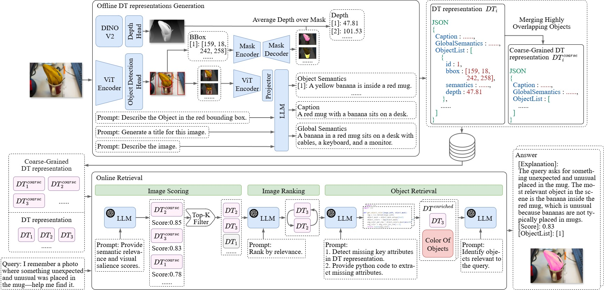

## Reasoning Text-to-Image Retrieval with Large Language Models and Digital Twin Representations

<div align="center">
  
</div>

## Setup

1. Create a Python environment:
```bash
conda create -n dtir python=3.10.16
conda activate dtir
```

2. Install dependencies:
```bash
pip install -r requirements.txt
```

3. Download required codes and checkpoints:
- OWL-ViT 2
- Depth-Anything 2
- SAM 2

## RT2I Dataset

The RT2I dataset is located in the `data/RT2I` directory, which contains both image data and reasoning-based queries.

## Usage

### Generate DT Representations

```bash
./script/digital_twins_generation.sh
```

Required parameters:
- `query_info`: Text query for image retrieval
- `image_dir`: Directory containing input images
- `output_digital_twins_dir`: Output directory for digital twin representations
- `owlvit_checkpoint_path`: Path to OWL-ViT checkpoint
- `depth_anything_checkpoint_path`: Path to Depth-Anything checkpoint
- `sam_config_path`: Path to SAM config
- `sam_checkpoint_path`: Path to SAM checkpoint
- `gpu_id`: GPU device ID (default: 0)

### Text-to-Image Retrieval

```bash
./script/text_to_image_retrieval.sh
```

Required parameters:
- `query_info`: Text query for image retrieval
- `image_dir`: Directory containing images to search
- `digital_twins_dir`: Directory containing digital twin representations
- `result_output_dir`: Output directory for results
- `gpu_id`: GPU device ID (default: 0)

Optional parameters:
- `scoring_llm_provider`: LLM provider for scoring (default: doubao)
- `scoring_llm_model`: Model for scoring (default: lite)
- `ranking_llm_provider`: LLM provider for ranking (default: deepseek)
- `ranking_llm_model`: Model for ranking (default: v3)
- `object_retrieval_llm_provider`: LLM provider for object retrieval (default: deepseek)
- `object_retrieval_llm_model`: Model for object retrieval (default: v3)

API Key:
- Set API Key for LLMs in `llm_api.py`
